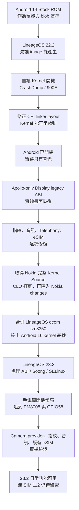

# 從一片背光到 Android 16：Nokia G60 5G 的 LineageOS Bring-up 手記

前言
---

這陣子，我以 Nokia G60 5G（代號 Apollo）的 Android 14 Stock ROM 為起點，先完成 LineageOS 22.2（Android 15）的 bring-up，再升到 LineageOS 23.2（Android 16）。

一開始我以為，最花時間的應該是把 device tree、vendor tree 和 kernel tree 整理到能夠編譯。實際做下去才發現，image 能產生真的只是起點。後面還有舊版 Qualcomm kernel、新版 Clang、Nokia 的 proprietary blobs，以及不同年代的 HAL 要一起磨合。

這篇就來記錄 Apollo 如何從 Android 14 Stock ROM 出發，先完成 LineageOS 22.2 的 bring-up，解掉 Qualcomm CrashDump、螢幕只有背光等問題，再一路升到 Android 16，並完成多項實機功能測試。

- 裝置：Nokia G60 5G / HMD Apollo
- SoC：Qualcomm SM6375 / Snapdragon 695 5G
- 歷程：Android 14 Stock ROM → LineageOS 22.2（Android 15）→ LineageOS 23.2（Android 16）
- 整理日期：2026-08-28

> 如果想查完整 commit、log 與除錯過程，可以延伸閱讀
> [重大事件與解法報告]()
> 和 [Display 黑屏深度 RCA]()。

Bring-up 歷程總覽
---

Apollo 比較麻煩的地方，是系統裡同時混著好幾個年代的介面：

- Qualcomm 5.4 kernel 搭配新版 Clang
- Nokia stock vendor blobs 搭配新版 Android framework
- source-built Qualcomm HAL 搭配 stock 私有 extension
- Android 15 還能通過、Android 16 卻開始嚴格檢查的 ABI、VINTF、Soong 與 SELinux 設定

這些東西拆開來看都沒有問題，組在一起卻不一定相容。後來遇到的大多數 bug，其實都是其中兩層對同一份資料或介面的理解不一樣。

整段 bring-up 大致可以整理成下面這條路線：



Kernel CrashDump：CFI 跳轉表
---

第一版自編 kernel 刷進去之後，Apollo 沒有停在 boot animation，也不是一般的 bootloop，而是直接進入 Qualcomm CrashDump／900E。看到這種情況，我一開始也懷疑過 DTBO、AVB、`vendor_boot`，甚至是某個早期驅動。

後來我把 stock 與 Lineage 的 image 交叉搭配測試：

- Lineage `vendor_boot` 搭配 stock `boot` 可以進 Recovery
- 換成自編的 `boot` 才會重現 CrashDump

這樣一來，問題範圍就縮到 kernel 本身。接著從 QPST dump 對齊 printk，才看到 PID 1 發生了 `kernel stack overflow`，並不是前面某個看起來很可疑的 driver probe failure。

真正的原因藏在 linker layout。Clang 19 產生了超過一萬個 `.text..L.cfi.jumptable.*` section，但舊 Qualcomm 5.4 arm64 linker script 沒有把它們明確放進永久的 `.text`。結果這些 CFI jump table 被放進 init memory，等 kernel 執行 `free_initmem()` 後就一起被清掉了。

稍後 `sched_clock` 再跳進已經被回收的 CFI target，例外處理不斷遞迴，最後把 kernel stack 用光。

修正本身只有 linker script 裡的一行：

```text
8e5d0adbdafef6f600d395587a05332e6e38554d
ANDROID: arm64: Place CFI jump table sections in .text
```

套用後，10,983 個 orphan CFI sections 歸零，kernel 也終於能夠正常進入 Android。這次之後，我看到 CrashDump 都不太敢再只盯著最後一條 driver log，因為真正出事的位置可能早就跑到別的地方去了。

Display 黑屏：ABI 錯位
---

Kernel 好不容易能開機，結果下一個問題是面板只亮背光，完全沒有畫面。

奇怪的是，ADB、MTP 和觸控都已經正常，`screencap` 也能抓到完整的 1080×2408 SystemUI。換句話說，Android 其實已經開好了，SurfaceFlinger 也有在畫，只是畫面沒有真的送到實體 panel。

這段期間查過不少方向：

- first-frame DMS 曾回傳 `-22`
- DSI、DSC 與 VFP timing
- panel bias、ESD、UBWC 和 DTBO
- source-built composer 與 stock display blob 的版本差異

first-frame DMS 確實有 bug，我也把 constrained mode change 延後到 first commit。不過修完之後，面板依然只有背光，表示它不是最後的根因。

真正的線索出現在 HWC／SDM 之間。SurfaceFlinger 已經交出 layers 和 client target，但 SDM dump 裡完全沒有有效的 pipe row。繼續追下去後，發現所有 `HWPipeInfo::valid` 到 source-built core 這邊都被讀成 false。

當時的 Display stack 是這個組合：

- source-built composer service
- source-built `libsdmcore.so`
- Nokia stock `libsdmextension.so`

問題就出在這裡。兩邊共用的是 Qualcomm 私有 C++ struct，並不是穩定的公開 ABI。新版 source 多了一個 `DeContentType content_type`，讓後面的欄位全部位移 4 bytes。

Stock extension 把 `valid=true` 寫到 `HWPipeInfo + 0x228`，source core 卻從 `+0x22c` 讀取。兩邊只差 4 bytes，但結果是所有 plane 都被當成無效。

> panel 有上電、背光有亮、Android 也畫好了 UI，DPU 卻沒有真正設定顯示平面。

最後沒有把整套 Display HAL 換回 stock，而是替 Apollo 做一組 source-built legacy ABI：

- 由 Apollo device tree 的產品變數啟用
- composer 與 `libsdmcore` 只在 Apollo build 使用舊 layout
- 加入 LP64 compile-time assertions，固定幾個重要 offset
- 其他使用同一套 HAL 的裝置仍維持新版 ABI

相關提交是 device tree 的 `722b33f`，以及 Display HAL 在 22.2 的 `32da0e84`、23.2 的 `c6e6d9d5`。

刷入修正版後，實體螢幕終於出現 LineageOS 的畫面。這個問題折騰了很久，最後竟然只是 stock extension 和 source core 對同一塊記憶體差了 4 bytes。

指紋服務
---

看到桌面之後，才算正式開始修「手機該有的功能」。Apollo 的側邊指紋不是補一條 SELinux allow 就能正常工作，中間陸續遇到：

- service 安裝路徑衝突
- 舊 blob 需要的 `libhidlbase` global symbols
- SONAME 與實際 library 名稱不一致
- HIDL RPC threadpool 從 2 改成 1 時，舊服務會直接 abort
- service、device node 與資料路徑缺少正確的 SELinux label

最後我把這些相容處理拆成局部 shim、獨立 service 和 device-specific policy，沒有去改 framework 的全域行為。到 23.2 時，指紋服務已經穩定，也能正常使用指紋解鎖。

設定指紋時還遇到一個比較單純的問題：引導箭頭跑到畫面左上角。原因是 framework 不知道 Apollo 側邊感應器的位置，只能套用預設座標。

overlay commit 已補上 `X=1080`、`Y=870`、`radius=115`。這個問題只需要改 resource overlay，不用碰 fingerprint HAL 或 kernel；不過這次沒有留下修正後的截圖，畫面位置還要等下次刷機時再確認。

音訊：回到原廠 ACDB
---

音訊一開始有兩個很明顯的症狀：

- 系統完全沒有聲音輸出
- 麥克風收不到聲音，而且錄製 17 秒的檔案播放時只剩約 3 秒

目前確認可用的聲音堆疊包含 Apollo 原廠 audio XML、QSSI policy 和完整 kernel audio topology。喇叭牽涉的改動很多，我沒辦法從現有 history 指定是哪一個 commit 讓它恢復；相較之下，麥克風的原因就清楚很多。

Lineage 當時啟用了 Fluence NN，Audio HAL 因而選到：

```text
dmic-nn + ACDB 205
```

但 Apollo stock 真正使用的是：

```text
dmic-endfire + ACDB 41
```

最直覺的作法可能是補上 ACDB 205，或修改共用 Qualcomm Audio HAL 去接受這條路徑。不過 Nokia 並沒有替 Apollo 準備這份校正，硬補上去也可能影響其他裝置。

最後只在 device tree 關閉 Fluence NN 與 subband：

```properties
ro.vendor.audio.sdk.fluence.nn.enabled=false
ro.vendor.audio.sdk.fluence.subband.enabled=false
```

這樣 HAL 就會回到 stock 使用的 `dmic-endfire + ACDB 41`。提交 `80c04b` 也保留了原始作者資訊，沒有修改 `hardware/qcom-caf/sm8350/audio`。

23.2 刷入後，speaker 使用 `speaker + ACDB 14`，錄音則使用 `dmic-endfire + ACDB 41`。約 17.3 秒的測試最後產生 17.17 秒 WAV，播放時也有正常訊號，不再出現錄很久、檔案卻只剩幾秒的狀況。

這次讓我比較確定的是，audio route 名稱對上還不夠，ACDB、mixer path、kernel topology 與 property selection 必須整組一致。能回到 stock 已知可用的設定，就沒有必要憑空生出另一份 calibration。

112：已送進 Modem，接通待測
---

無 SIM 撥打 112 是目前還沒測完的功能。

`112` 原本就存在 emergency number database，所以再加一筆號碼並沒有用。第一個真正卡住的地方，是 emergency Telecom 路徑遇到 Android 14 private API 差異，Bluetooth DSDA 呼叫會直接造成 crash。把這個 crash 修掉後，撥號流程才能繼續往下走。

接著是 IMS MMTEL provider。Apollo 已經安裝 `org.codeaurora.ims`，但 Telephony overlay 裡的 `config_ims_mmtel_package` 還是空的。補上之後，實機 log 可以看到：

- `EmergencyNumberTracker` 正確認出 112
- `QImsService` 送出 `REQUEST_EMERGENCY_DIAL`
- radio service state 顯示 LTE `availableServices=[EMERGENCY]`
- 呼叫已經進入 modem，沒有停在 Dialer 或 Telecom

不過，那次呼叫約 13 秒後便以 `CODE_USER_TERMINATED (501)` 結束，實際上沒有接通。後來檢查 23.2 時，手機裡已經有 active eSIM，不再符合完全無 SIM 的測試條件。

所以目前只能確認 112 已經可以從 Dialer 一路送進 modem；完全無 SIM 時，網路是否會接受呼叫並接通 PSAP，還需要找合適且安全的條件再測一次。

SIM、eSIM 與電信服務
---

當時還有另一個很容易和 112 混在一起的問題：無法進入「設定 → 網路與網際網路 → SIM 卡」，也不能新增 eSIM profile。

Apollo 雖然在 framework 宣告支援 eSIM，系統裡卻缺少完整的 `EuiccService`、LPA 和 provisioning UI。後來補上：

- LPA 與必要的 privileged permissions
- Apollo partner configuration
- 支援國家 `us / gb / tw`
- SM-DS address `lpa.ds.gsma.com`
- eSIM slot 1、pSIM slot 0 的對應

修正後，23.2 的 SIM 頁面可以正常進入，也能看到兩個既有 eSIM profiles 和「新增 SIM」入口。這次我沒有另外下載新的 profile，下載與啟用流程留待之後再測。

`qccsyshal@1.2-service` 則是另一條線。在 22.2，它被安裝到 `system_ext`，但 framework-side VINTF manifest 沒有 declaration，導致 `hwservicemanager` 拒絕註冊，init 每五秒就重啟一次。補上 manifest 後，服務才穩定下來。

升級 Android 16 後，qccsyshal 的 proprietary implementation 又遇到 protobuf ABI 版本差異。我最後使用 Apollo device-only extraction-time binary fixup，把它的 `DT_NEEDED` 對齊 Lineage 現有的 `libprotobuf-cpp-full-21.7.so` compatibility library。

eSIM、qccsyshal 和緊急撥號雖然都出現在 SIM 與通話附近，實際上卻是三條不同路徑。eSIM 頁面修好後，緊急撥號不會自動跟著正常；qccsyshal 穩定後，IMS provider 也還是得另外確認。

取得 Nokia Kernel Source
---

早期的 Apollo kernel tree，只能從不完整的公開來源、相近平台與 stock 產物慢慢補。Nokia HMD 原先公開的 archive 約有 64,013 個 paths，缺少完整 techpack、Apollo defconfig 和 device kernel DTS，偏偏這些都是最能說明實際硬體配置的部分。

在寄信給 Nokia HMD 道德合規辦公室後，我終於拿到完整的 V3.170 kernel source。

完整 package 約有 70,078 個 paths，比舊 archive 多 6,065 個 paths，增加約 1,580,544 行；原本重疊的檔案則保持一致。

我沒有直接把 tarball 蓋進原本的 tree，而是照下面的順序重建：

1. 先從 Qualcomm CLO 匯入 qcacld、host-cmn、fw-api、video、display、IPA、camera、audio、rmnet 等 subtrees，並以 `ad81f99b20eb2debe609e4b25d135b5366194d0b` 作為 last-good checkpoint
2. 從這個 checkpoint 接續，加入 CLO camera／display DTS baseline
3. 匯入 Nokia／QCM6490 updates，再 merge Nokia V3.170 snapshot，shared paths 以 Nokia changes 為準
4. 重新產生 Apollo defconfig，切換到官方 Apollo target

順序很重要。CLO 提供 Qualcomm 平台的共同基線，Nokia changes 才是 Apollo 量產版本的實際差異。如果先放 Nokia、再用 CLO 覆蓋，panel、audio、camera、WLAN 或 power topology 都可能被 reference design 蓋回去。

完整 source 到位後，大部分原先靠逆向補出的內容，都能換回可追溯的正式來源。唯一的例外是 Apollo camera sensor topology：archive 有引用卻沒有附上，只能從 stock DTBO 重建。重建後的輸出與 stock 內容 byte-for-byte 一致。

對我來說，這是整個專案很重要的轉折。在拿到完整 source 以前，我只能想辦法重現 stock 行為；拿到之後，才有機會把 kernel tree 整理成可以長期維護的狀態。

合併 LineageOS Kernel
---

Apollo kernel 能正常工作後，下一步是接上 `LineageOS/android_kernel_qcom_sm8350` 的 `lineage-20` 基線，再延伸到 `lineage-22.2`。

這次 merge 一共有約 179 個 conflict paths。處理方式不能只看哪邊比較新，而是要看檔案負責什麼：

- 通用 kernel、Android integration 與 toolchain compatibility 優先採用 LineageOS／QSSI15
- Apollo DTS、audio、camera、display、WLAN 與 HMD-specific 邏輯需要保留
- 共用 tree 已經有的 Android 16 BPF／FUSE-BPF backports 不再重複加入
- merge 完重新產生 config，再測 `boot`、`vendor_boot`、`dtbo` 和完整 OTA

主要 merge commit 是 `ac2bbb0b70a9`，後續再用 `4ec90c4` 重新產生 config。完成後不只 kernel image 能編譯，整包 OTA 也能正常刷入與開機。

Kernel merge 最麻煩的地方，從來不是把 Git conflict 清到零。尤其 device DTS 不能當成普通文字檔二選一，不然很容易得到一棵語法可以編譯、實機硬體卻完全不認得的 tree。

Android 16 相容性調整
---

完成從 Android 14 Stock ROM 到 LineageOS 22.2 的第一階段 bring-up 後，接著升到 23.2 並不等於重新 bring-up 一次。Device tree、vendor tree 都沿用 22.2，kernel 也已經包含 Android 16 所需的 BPF backports。真正花時間的是 Android 16 對舊介面檢查得更嚴格。

這一輪處理的項目包括：

- product matrix 路徑與 Stagefright XML
- Soong boolean property 型別
- proprietary blob 所需的 tinyxml2 舊 ABI
- Doze brightness float resource
- USB property 與 RFSA generated module naming
- NFC 重複 context
- WFD 所需的舊 `AudioSystem` ABI
- qccsyshal protobuf ABI
- task profiles 與 BPF metadata override
- duplicate contexts 等 build-time 檢查

其中有些問題會讓 build 直接失敗，有些則是開機後才讓 vendor service 靜默崩潰。我依照各個 blob 的需求，分別使用 Apollo-only shim、binary fixup 或 device-side 設定，避免為了 Apollo 去改 ROM-wide 的 shared HAL。

手電筒常亮：GPIO 設定
---

LineageOS 23.2 刷入後，出現了一個非常直觀的 bug：手機還在 Powered by Android／Android One logo 階段，手電筒就已經亮起。

進入系統後，Android 還認為 torch 是 OFF；手動把燈熄滅之後，又無法從系統重新打開。因為問題在 userspace 啟動前就發生，framework、Camera app 和一般 HAL 很快就能排除。

最後查到 reference-board DTS 裡的 PM8008 預設 pinctrl：

- reference design 會宣告並 claim GPIO58
- Apollo 把 GPIO58 當作 flash ENM/PWM
- GPIO51 是 flash ENF
- Apollo 實機沒有那些 PM8008 consumers

也就是說，一段不屬於 Apollo 的 reference configuration，在 kernel 很早期就把 flash enable pin 拉高。Android 不知道燈已經亮了，等 Camera provider 接手時，也沒有把 bootloader／pinctrl 留下來的狀態確實清成 low。

修正分成三個提交：

- `d42dc695b819`：在 Apollo DTS 停用未使用的 `pm8008_8`／`pm8008_9`
- `16b72f0904c7`：camera probe 時先選 `flash_enm_low`／`flash_enf_low`，再釋放 pinctrl
- `63be96dc73bc`：補上 `msm-camera.h` 與 `pinctrl/consumer.h` includes，修正編譯

刷入後，live DT 顯示 PM8008 節點已 disabled，GPIO51／58 idle 都是 0。從系統開啟、關閉手電筒也恢復正常，Camera provider 沒有崩潰或新增 AVC。

這個 bug 很直接地提醒我，即使沒有 consumer，device tree 裡多出來的節點仍可能影響硬體。對 GPIO、regulator 和 pinctrl 來說，一個不該存在的 reference node，就足以在 Android 出現前先改變 pin 狀態。

SELinux 權限整理
---

23.2 後段已經不是能不能開機的問題，而是 Camera、fingerprint、vendor services 和 power-related nodes 能不能穩定工作。

這一階段補上 camera persist、board ID、metadata lookup、FMQ properties、camera serial、wakeup、vibrator／extcon、Perf2 等 label 與權限。PPD 也拆到獨立 domain，避免和其他服務共用過大的權限。

有些 denial 則不應該放行：

- `vendor_ppd` 切換 domain 時會繼承 `vendor_qti_init_shell` 的 stdout／stderr file descriptors，但實際上不需要使用，因此用 `dontaudit vendor_ppd vendor_qti_init_shell:fd use` 壓掉噪音
- 指紋資料庫位於 `/data/vendor_de/0/fpdata`；舊 blob 的 storage-update fallback 還會嘗試 `/data/silead/fp`，但沒有必要為此開放 root data write，所以維持 deny 並加上 `dontaudit`

整理 SELinux policy 時，我不會把每一條 `avc: denied` 都直接轉成 allow。還是得先確認這個 access 是否為功能所需、能不能靠正確 label 解決，以及放行後會不會給 service 超出職責的存取權限。

最後留下來的做法，就是需要的權限精準補上，不合理的舊行為繼續擋住。Log 不一定要完全沒有 denial，但每一條 allow 都應該說得出原因。

Recovery、狀態列與 scrcpy
---

這段 bring-up 還處理了一些規模比較小、但使用者很容易注意到的問題：

- Recovery 一開始沒有觸控，最後補回正確的 touchscreen firmware
- Bluetooth UART 設定需要調整
- 左上角時間太靠近圓角，只把 portrait 左側 padding 改成 20dp，不動右側電量與 landscape
- 指紋引導箭頭透過 overlay geometry 移回電源鍵附近
- scrcpy 在 1080×2408 首次呼叫 `c2.qti.avc.encoder` 時回傳 `IllegalArgumentException`，原因是長邊 2408 超過 encoder 的 1920 上限；自動降到 864×1920 後即可使用，也可以直接執行 `scrcpy -m1920`
- BoringSSL extract-cert、Clang warning、Ninja restat、重複 file contexts 等 build failures 也有處理，但它們和實機 runtime 問題並不相同

其中新版 Clang warnings 主要來自匯入完整 HMD／CLO kernel source 後留下的 build debt；Ninja restat 則和重新產生 `.config` 後的 dependency／timestamp 有關，並不是 Android 16 kernel 或 BPF 在實機上壞掉。

這次學到的事
---

### 先找出問題在哪一層

Stock boot 搭配 Lineage `vendor_boot` 的交叉測試，把 CrashDump 指向 kernel；`screencap` 有畫面但實體 panel 沒畫面，把範圍縮到 HWC 後面；開機 logo 階段手電筒就亮起，則把問題提前到 bootloader／kernel pinctrl。

先做幾個能夠切分範圍的測試，通常比直接開始改 code 更省時間。

### 私有 ABI 要特別小心

Display 只差 4 bytes，所有 planes 就會被跳過；指紋與 WFD 可能只缺一個舊 symbol 或 SONAME，service 就完全起不來；qccsyshal 的 protobuf major ABI 不一致，也會在 Android 16 直接失效。

Library 能被 linker 載入，不代表兩邊真的理解同一個 struct、symbol 和生命週期。

### 修正只影響 Apollo

Display legacy ABI 透過產品變數只在 Apollo 啟用；audio 回到 stock property；tinyxml2、protobuf 和 AudioSystem 的相容處理也限制在需要的 blob；UI 座標則留在 overlay。

這樣修 Apollo 的同時，才不會讓其他共用相同 HAL 的裝置一起承擔未知 regression。

### OEM Source 的價值

完整 Nokia source 讓 audio、camera、display、WLAN 和 power topology 從逆向推測回到可追溯的硬體描述。CLO 是 Qualcomm 平台基線，Nokia changes 則是量產 Apollo 真正使用的差異，匯入順序也不能顛倒。

### 驗證到哪，就寫到哪

指紋有實際解鎖測試；麥克風有 route、ACDB、錄音長度與訊號；手電筒有 live DT、GPIO idle 和 ON／OFF 測試；螢幕也有實體顯示結果。

112 目前只有 ROM 到 modem 的紀錄，還沒有完全無 SIM 時接通 PSAP 的結果，所以現在還不能寫成「已修好」。等有合適的測試條件，再把最後一段補完。

目前狀態與待辦
---

從 Android 14 Stock ROM 一路走到 LineageOS 22.2，再升上 LineageOS 23.2 後，Apollo 已經不再只是一台勉強能開機的測試機。Display、指紋、音訊、SIM 頁面、既有 eSIM profiles、qccsyshal 與手電筒都已經能正常使用；尚未完成的項目則整理在下表。

| 問題 | 處理方式 | 目前狀態 |
|---|---|---|
| Kernel CrashDump／900E | 將 CFI jump tables 固定放進永久 `.text` | 已驗證 |
| 螢幕只有背光 | Apollo-only source-built SDM legacy ABI | 已驗證 |
| 指紋服務 | service 隔離、HIDL／SONAME／threadpool shims、精準 policy | 已驗證解鎖 |
| 指紋引導箭頭 | side-FPS overlay geometry | overlay 已套用，畫面待重測 |
| 音訊輸出 | 恢復 stock XML／QSSI policy 與完整 kernel topology | Speaker route 已驗證 |
| 麥克風與錄音長度 | 關閉 Fluence NN／subband，回到 ACDB 41 | 已驗證 |
| 無 SIM 112 | 修正 DSDA crash、指定 QTI IMS MMTEL provider | 已送進 modem，接通待測 |
| SIM／eSIM | LPA、privapp permissions、partner config 與 slot mapping | 頁面與既有 profiles 已驗證 |
| qccsyshal | framework VINTF 與 Android 16 protobuf `DT_NEEDED` fixup | 已驗證 |
| Kernel source | CLO subtrees → Nokia V3.170 changes | 已完成 |
| LineageOS Kernel | 保留 Apollo 硬體差異，合併共用 Android integration | 已驗證 |
| Android 16 | ABI shims、Soong、matrix 與 task profile 修正 | Build／boot 已驗證 |
| 手電筒常亮 | 停用錯誤 PM8008、初始化 GPIO51／58 low | 已驗證 |
| Camera／SELinux | 補齊 labels 與 service 權限 | Provider 已驗證，完整相機回歸待測 |
| scrcpy encoder error | 將長邊限制為 1920 | 不需修改 ROM |

其中最需要補完的，還是完全無 SIM 時的 112 實際接通測試。ROM 端已經能把 request 送進 modem，但仍要找合法、安全的條件重新測一次。

總結
---

回頭看，Apollo 是從 Android 14 Stock ROM 出發，先完成 LineageOS 22.2 的 bring-up，再升到 LineageOS 23.2。從第一版 kernel 直接進 CrashDump，到 Android 已經開機卻只有一片背光，中間不少問題都比我原先預期得更深。尤其 Display 那個只差 4 bytes 的 private ABI，真的是不把資料一路追到底，很難想到問題會藏在那裡。

現在 Apollo 已經能穩定跑進 Android 16，指紋、音訊、SIM 頁面、既有 eSIM、手電筒等功能也都能正常使用。剩下的新 eSIM profile、完整相機回歸和無 SIM 112，我會在有合適條件時繼續補測。

這次 bring-up 花了不少時間，不過也讓整棵 kernel、device 和 vendor tree 從「想辦法讓它開機」，慢慢整理成比較能追蹤、也比較能繼續維護的狀態。

About Me
---
我是 EdwardWu

- Telegram：[EdwardWu](https://t.me/edwardwu0223)
- Instagram：[_920223](https://www.instagram.com/_920223/)
- GitHub：[bluehomewu](https://github.com/bluehomewu)
- Email：[bluehome.wu@gmail.com](mailto:bluehome.wu@gmail.com)

###### tags: `Android` `LineageOS` `Nokia` `Nokia G60 5G` `Custom ROM` `Kernel` `Bring-up`
