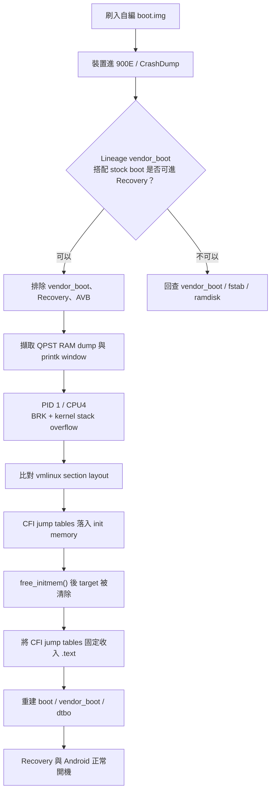
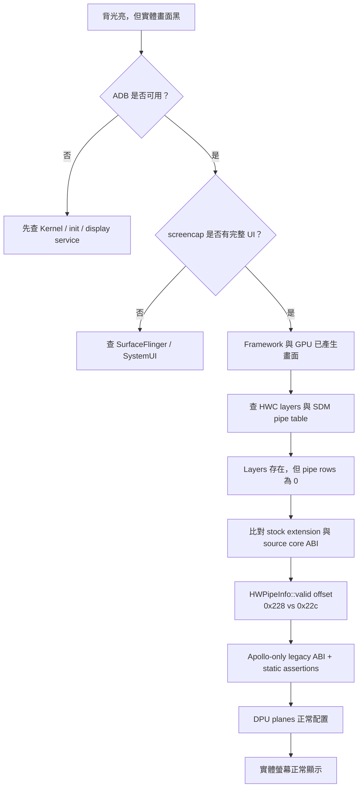
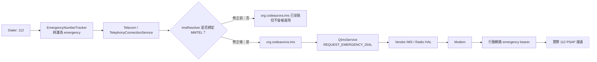
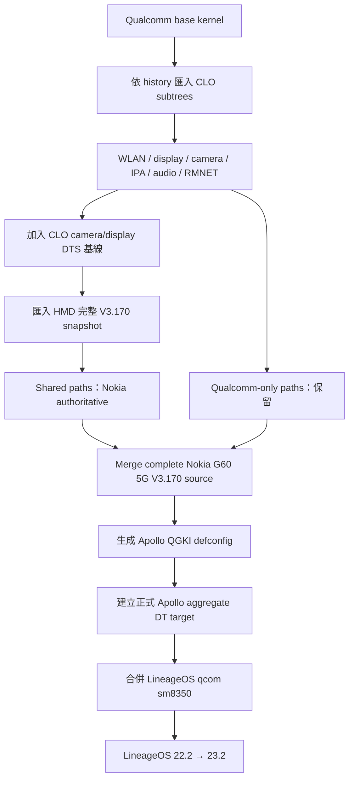

- 裝置：Nokia G60 5G / HMD Apollo
- SoC：Qualcomm SM6375 / Snapdragon 695 5G
- 涵蓋版本：LineageOS 22.2（Android 15）至 LineageOS 23.2（Android 16）
- 報告日期：2026-08-28
- 工作區：`~/lineage-23.2-apollo`
- 既有 Display 深度 RCA：[APOLLO_DISPLAY_BLACK_SCREEN_RCA.md]()

## 1. 報告目的與判定方式

本報告整理 Apollo 從 LineageOS 22.2 初始 bring-up、Kernel 來源重建、LineageOS 共用 Kernel 合併，到 LineageOS 23.2 實機穩定化期間遇到的重大故障、根因、正式修法與驗證狀態。

本報告刻意區分三種狀態：

- **已驗證**：修正已編譯、刷入，且有實機功能或 log 證據。
- **已實作但仍待端到端驗證**：ROM 內部路徑已修復，但欠缺最後一段真實環境測試。
- **歷史整合解法**：問題最後消失，但現存 history 不足以把結果歸功於單一 commit，因此不虛構單一根因。

### 1.1 執行摘要

| # | 重大事件 | 最終根因／核心解法 | 狀態 |
|---|---|---|---|
| 1 | 自編 Kernel 開機進 Qualcomm CrashDump／900E | CFI jump table 被放進 init memory；固定收入永久 `.text` | 已驗證 |
| 2 | 螢幕只有背光、不顯示 | Stock SDM extension 與 source core private ABI 錯位；Apollo-only legacy ABI | 已驗證 |
| 3 | Stock 指紋服務在 Android 15/16 崩潰或無法載入 | Service 隔離、HIDL/SONAME/threadpool shims、精準 SELinux | 已驗證 |
| 4 | 無音訊輸出、麥克風無聲、17 秒錄音只剩 3 秒 | Stock audio contract + 正式 Kernel topology；關閉 Fluence NN/subband，回到 ACDB 41 | 已驗證 |
| 5 | 無 SIM 112 無法完成撥號 | 移除 DSDA crash source；指定 `org.codeaurora.ims` 為 MMTEL provider | ROM 路徑已修，無 SIM 接通仍待驗證 |
| 6 | SIM 設定頁／eSIM provisioning／qccsyshal | 補 LPA、partner config、framework VINTF；Android 16 protobuf versioning | 已驗證 |
| 7 | HMD 公開 Kernel Source 不完整 | CLO subtrees 打底，再匯入完整 Nokia V3.170 changes | 已完成 |
| 8 | 合併 LineageOS qcom sm8350 與 Android 16 BPF 基線 | 解衝突、保留 Apollo 硬體內容、取得 FUSE-BPF 等 backports | 已驗證 |
| 9 | LineageOS 23.2 proprietary ABI／build contract 遷移 | tinyxml2、AudioSystem、protobuf、task profiles 等 Apollo-only compatibility | 已驗證 |
| 10 | 手電筒從 boot logo 起常亮，熄滅後不能再開 | PM8008 誤佔 GPIO58；停用未使用節點並在 probe 將 flash pins 初始化為 low | 已驗證 |
| 11 | Camera／SELinux post-bring-up 穩定化 | 精準 labels、FMQ properties、獨立 PPD domain、保留不應放行的 deny | 已驗證 |

## 2. 整體時間軸

```mermaid
flowchart LR
    A["LineageOS 22.2<br/>Device/Vendor 初始 bring-up"] --> B["自編 Kernel<br/>CrashDump / 900E"]
    B --> C["Kernel CFI linker 修正<br/>可正常開機"]
    C --> D["Android 已開機<br/>實體螢幕只有背光"]
    D --> E["Apollo-only SDM legacy ABI<br/>螢幕正常"]
    E --> F["Audio / Fingerprint / Telephony<br/>runtime contract 修復"]
    F --> G["無 SIM 112、eSIM、qccsyshal<br/>分開處理"]
    G --> H["取得 HMD 完整 V3.170 source"]
    H --> I["CLO subtrees → Nokia authoritative import"]
    I --> J["合併 LineageOS qcom sm8350<br/>Android 16 BPF 基線"]
    J --> K["LineageOS 23.2<br/>ABI / Soong / Vendor 遷移"]
    K --> L["手電筒 GPIO58 / PM8008 修復"]
    L --> M["Camera、SELinux、服務穩定化"]
    M --> N["23.2 OTA 開機與功能驗證完成"]
```



---

## 3. 重大案件一：首次 Kernel 開機進 Qualcomm CrashDump／900E

### 3.1 症狀

- 刷入自編 `boot.img` 後，手機沒有進入 Android 或 Recovery，而是落入 Qualcomm CrashDump／EDL 900E。
- 使用 Lineage `vendor_boot` 搭配 stock `boot` 可以進 Recovery。
- 只有換成自編 Kernel 的 `boot.img` 才重現。

上述 A/B 已先排除：

- `vendor_boot` 本身；
- Recovery userspace；
- AVB／分區打包；
- 單純 DTBO 或 userspace 問題。

QPST dump 對應的 Kernel release 為：

```text
5.4.254-qgki-960007-gdd1531fd3da0
```

從對齊後的 printk window 可讀到：

```text
Insufficient stack space to handle exception!
ESR: 0xf2000800 -- BRK (AArch64)
CPU: 4 PID: 1 Comm: swapper/0
Kernel panic - not syncing: kernel stack overflow
```

### 3.2 真正根因

Clang 19 產生大量：

```text
.text..L.cfi.jumptable
.text..L.cfi.jumptable.*
```

舊 Qualcomm 5.4 arm64 linker script 沒有把它們明確收進 `.text`。結果 10,983 個 CFI jump-table sections 成為 orphan sections，位置落入：

```text
__init_begin ... __init_end
```

Kernel 完成初始化後執行 `free_initmem()`，這些 jump tables 隨 init memory 一起被釋放／清零。PID 1 後續經 `sched_clock` 間接跳到已清除的：

```text
arch_counter_get_cntvct.cfi_jt
```

第一次非法指令又破壞例外處理路徑，UDF／BRK handler 反覆進入例外，最後耗盡 Kernel stack 並 panic，平台因而進入 CrashDump／900E。

這不是 `rmnet_shs` module-init CFI warning。Tree 中雖另有 `e70533ab68da` 修正 datarmnet CFI signature，但 Apollo 這次 900E 的 QPST dump 與實際 panic 對應的是 linker layout。

### 3.3 正式修法

套用 Sami Tolvanen 的 Android arm64 linker 修正：

```text
8e5d0adbdafef6f600d395587a05332e6e38554d
ANDROID: arm64: Place CFI jump table sections in .text
```

核心改動：

```diff
			TRAMP_TEXT
+			*(.text..L.cfi.jumptable .text..L.cfi.jumptable.*)
			*(.fixup)
```

修正後：

- orphan CFI jump-table sections：10,983 → 0；
- 42,736 個 CFI stubs 均位於永久 `.text`；
- `free_initmem()` 不再回收 CFI target；
- 新 image 可正常進 Recovery，後續也可進 Android。

### 3.4 診斷流程



---

## 4. 重大案件二：螢幕只有背光、不顯示

完整逐步 RCA 已保存在：

[APOLLO_DISPLAY_BLACK_SCREEN_RCA.md]()

本節記錄最終已由實機確認的結論。

### 4.1 症狀與關鍵隔離

- LineageOS 已完成開機；
- ADB、MTP 與觸控正常；
- `screencap` 能取得完整 1080×2408 UI；
- SurfaceFlinger 有 layer 與 client target；
- 實體面板只有背光，沒有任何 pixel output。

因此問題不在：

- Framework 沒有產生 UI；
- SystemUI crash；
- panel 完全未上電；
- DSI host 完全沒有啟動。

### 4.2 前置問題：first-frame DMS

早期 log 有：

```text
DMS not supported on first frame
DSI display prepare failed, rc=-22
```

修法是將 constrained mode change 延後到 first commit：

| 分支 | Commit |
|---|---|
| LineageOS 22.2 | `e7ed277dd1da6b1e23a67528723c5d00ffe1d30b` |
| LineageOS 23.2 | `c9173251943945bfa1c6587906e4534f57793386` |

這使 DSI prepare error 消失，但螢幕仍黑，因此 DMS 是必要的前置修正，不是最後根因。

### 4.3 決定性證據

HWC 已收到正常 layers，但 SDM pipe table 完全沒有有效 pipe row。也沒有 `No hardware layers programmed`，表示 layer vector 存在，只是所有 `HWPipeInfo::valid` 都被 core 看成 false。

實際組合為：

- source-built composer service；
- source-built `libsdmcore.so`；
- Nokia stock `libsdmextension.so`。

Stock extension 的 SHA-256：

```text
5713b26b5b03d31254e8f186a9e122bc2fc20ee8c2c4306d3ef76f27ce5fae55
```

Stock extension 把 `valid=true` 寫到 `HWPipeInfo + 0x228`，新版 source core 卻從 `+0x22c` 讀取。

差異源自新版 source 多出的：

```cpp
DeContentType content_type;
```

它使 private structures 依序多出 4 bytes：

| Structure | Stock ABI | 新版 source ABI |
|---|---:|---:|
| `DisplayDetailEnhancerData` | `0x28` | `0x2c` |
| `HWDetailEnhanceData` | `0x3c` | `0x40` |
| `HWScaleData` | `0x1d8` | `0x1dc` |
| `HWPipeInfo::valid` offset | `0x228` | `0x22c` |

Stock extension 寫入的 `flags`、`valid`、`is_virtual` 因而全部錯位。DRM `SetupAtomic()` 看見 `valid=false`，跳過所有 plane programming，形成精確的：

> panel、DSI、背光均正常，但 DPU 沒有 framebuffer plane。

### 4.4 已排除但不是根因的方向

- Recovery panel payload；
- DTB／DTBO panel timing；
- SM5109C bias；
- orphan `display_panel_avdd`；
- ESD／DSI reset；
- DSC topology 與 60 Hz VFP；
- UBWC catalog/layout。

其中部分確實需要修正，但都無法解釋「SurfaceFlinger 正常、所有 SDM pipes 卻無效」。

### 4.5 正式修法：Apollo-only source-built legacy ABI

沒有改用 stock `libsdmcore`，也沒有全域修改其他 Qualcomm 裝置：

1. Apollo Device Tree 設定：

   ```text
   qtidisplay.apollo_stock_extension_abi=true
   ```

2. 只對 Apollo 的 composer service 與 `libsdmcore` 加入：

   ```text
   SDM_APOLLO_STOCK_EXTENSION_ABI
   ```

3. Apollo build 排除新增的 `content_type` 欄位，composer 同步不寫該欄位。
4. LP64 build-time assertions 固定 private ABI：

   ```text
   sizeof(DisplayDetailEnhancerData) == 0x28
   sizeof(HWDetailEnhanceData)       == 0x3c
   sizeof(HWScaleData)               == 0x1d8
   offsetof(HWPipeInfo, flags)       == 0x224
   offsetof(HWPipeInfo, valid)       == 0x228
   offsetof(HWPipeInfo, is_virtual)  == 0x229
   sizeof(HWPipeInfo)                == 0x300
   ```

相關 commits：

| 功能 | LineageOS 22.2 | LineageOS 23.2 |
|---|---|---|
| Display HAL legacy ABI | `32da0e84ed20a15d43b8ad421a636045c6b3664f` | `c6e6d9d53030fc9edbf942ba26a94d08f59bc60a` |
| Device opt-in | `722b33fe782fa468e28c6e9fb2772711d54d02bc` | 由 22.2 原樣繼承 |

22.2 與 23.2 兩組 HAL commits 的 stable patch-id 相同，代表 23.2 是同一修法的精確移植。

### 4.6 RCA 流程



---

## 5. 重大案件三：Stock Fingerprint stack 相容性

Apollo 使用多個 proprietary fingerprint components。從 Android 14 stock blobs 搬到 Android 15／16 時，並不是單一 HAL permission 問題，而是數個 loader 與 runtime contract 疊加。

### 5.1 問題與修法

| 問題 | 根因 | 修法／Commit |
|---|---|---|
| Fingerprint service 安裝衝突 | Stock dual-backend service 與 AOSP 2.1 module 使用同一路徑 | 改成 Apollo 專用 binary、rc、VINTF artifact；`b825142` + vendor `fc9acde` |
| FPSensor interface 載入失敗 | 舊 interface 依賴 modern `libhidlbase` 已移除的 constructor-map globals | 注入 `libhidlbase_shim.so`；`c5d2260` + vendor `30ddb21` |
| FPSensor HAL identity 不一致 | 實際安裝檔名與 ELF 內嵌 SONAME 不同 | extraction 時修正 SONAME；`e1dc364` + vendor `d87f0fb` |
| Fingerprint service 啟動後 abort | Extension 先啟動 HIDL pool=2，main 又要求縮成 1；Android 15 禁止縮小 active pool | Interpose `configureRpcThreadpool()`，保留至少 2 threads；`8de94d9` + vendor `e9f218f` |
| Enforcing 下找不到 backend／property | Dual backend labels 與 hwservice/property contexts 不完整 | Apollo peripheral SELinux policy；`e91ff67` |

### 5.2 UI geometry 是另一個次要案件

指紋設定引導箭頭錯位並不是 HAL failure。Framework 已知它是 power-button FPS，但缺少 side-FPS physical geometry，因而使用錯誤 fallback 座標。

`0b557c033639fccc9ceb86f98104cbe7be605486` 加入：

```text
displayId = local:4630946855316229249
X         = 1080
Y         = 870
radius    = 115
```

### 5.3 驗證

- Fingerprint services 可穩定啟動，沒有 threadpool abort。
- 23.2 刷入後，使用者已明確確認指紋可以正常解鎖。

---

## 6. 重大案件四：Audio output 與錄音

### 6.1 早期完全沒有音訊輸出

早期 22.2 實機曾回報所有情境都無音訊。當時的 log 顯示：

- `holi-qrdsku1-snd-card` 已註冊；
- AudioFlinger、AudioPolicy 與 primary HAL 都在；
- HAL 會選擇 `speaker`、啟用 mixer path，並送出 ACDB 14；
- 因此不是單純「沒有 Audio HAL」。

現存 commit history 沒有一筆可以誠實地宣告為唯一 speaker fix。最後可工作的音訊堆疊是以下整體結果：

- `f21219a`：將 Nokia stock mixer、platform、policy、sound-trigger XML 放入 Device Tree；
- `372571c`：使用 stock-active QSSI audio policy，避免 generic fallback 缺少 haptics、call-screening 與 direct PCM routes；
- `173a17f`：build source sound-session recording library；
- `889d97b`：還原 stock routing、mute、noisy 與 offload timing properties；
- 改用 HMD 完整 Apollo audio DTS 與正式 Qualcomm/Nokia audio techpack。

因此這一段應定義為「整體 audio contract 與正式 Kernel topology 修復」，而不是虛構某一行 property 單獨修好 speaker。

### 6.2 麥克風沒有收音，17 秒錄音只剩約 3 秒

這個案件有明確根因。

當：

```properties
ro.vendor.audio.sdk.fluence.nn.enabled=true
```

source HAL 會選擇：

```text
SND_DEVICE_IN_HANDSET_DMIC_NN
→ mixer path: dmic-nn
→ ACDB device: 205
```

Apollo stock audio calibration 並沒有對應的 Fluence NN／ACDB 205 contract。原廠實際路徑是：

```text
SND_DEVICE_IN_HANDSET_DMIC
→ mixer path: dmic-endfire
→ ACDB device: 41
```

強迫 `dmic-nn + ACDB 205` 會讓 capture path 取得錯誤或無效 calibration，造成無訊號與錄音時間軸異常。

### 6.3 正式 device-only 修法

保留 Device Tree 內的 stock audio XML，不修改共用：

```text
hardware/qcom-caf/sm8350/audio/
```

Device property 改成：

```properties
ro.vendor.audio.sdk.fluence.nn.enabled=false
ro.vendor.audio.sdk.fluence.subband.enabled=false
```

Commit：

```text
80c04b
sake: Disable fluence NN & subband
```

該 commit 保留原作者 Alexander Koskovich。

### 6.4 為何不補 ACDB 205

- ACDB ID 不是可以任意宣告的 route number；
- 它必須對應 OEM 在 DSP／ACDB database 內真正校準的 topology；
- 造出一筆 205 mapping 不會自動產生 Nokia 的 NN calibration；
- 修改共用 HAL 會讓 Apollo 的 stock blob contract 影響其他裝置。

正確做法是回到 OEM 已存在的 `dmic-endfire + ACDB 41`。

### 6.5 23.2 實機驗證

- 喇叭成功走 `speaker + ACDB 14`；
- 錄音成功走 `dmic-endfire + ACDB 41`；
- 實際錄製約 17.3 秒，WAV duration 為 17.17 秒，不再縮成 3 秒；
- 播放測試音時，錄音訊號由約 -55 dB 上升到 -26.6 dB，確認麥克風確實有收音；
- 測試未產生新的 Audio AVC。

---

## 7. 重大案件五：無 SIM 112 緊急撥號

這個案件必須和 eSIM、qccsyshal 分開記錄。

### 7.1 不是 Emergency Number DB 缺少 112

Apollo 已 build QCRIL database，且 radio/framework 的 emergency list 包含 112。Taiwan MCC 466 的 OEM row主要列 110／119，但 generic MCC 001 與 modem default list已有 112。

因此「在 SQL 再補一筆 112」不是最後修法。

### 7.2 第一階段：移除會干擾 emergency Telecom 的 DSDA service

`BluetoothDsDaService.apk` 使用 Android 14 已移除的 private `TelephonyManager`／`BluetoothHeadset` APIs，並在 Telecom 處理 emergency call 時 crash。

修法：

| Tree | Commit |
|---|---|
| Device | `df27c753ff379be5de6892cf0a6a5141d97d41cf` |
| Vendor | `e2bfb7e4eb6f517d0696c9e36353827187dd3939` |

移除 legacy APK 與 default-permission，交回 Android 平台 `BluetoothInCallService`。

這是必要的 crash-loop cleanup，但第一次 OTA 後 112 仍無法完成，因此它不是最後一層根因。

### 7.3 第二階段：ImsResolver 沒有綁定 Stock IMS

裝置上已有 `org.codeaurora.ims`，其 service 也支援 MMTEL；但：

```text
config_ims_mmtel_package = ""
```

ImsResolver 只會 discover package，卻不會將它選成正常／緊急 MMTEL provider。

修法：

```text
08f7974
apollo: Select the stock IMS service
```

Telephony overlay 明確設定：

```text
org.codeaurora.ims
```

讓正常 MMTEL 與 emergency MMTEL 均可綁定 stock IMS。

### 7.4 修正後的 live call-path 證據

後續無 SIM 112 嘗試中：

- `EmergencyNumberTracker` 找到 112；
- Framework 建立 emergency Telecom connection；
- QImsService 發出 `REQUEST_EMERGENCY_DIAL`；
- vendor IMS HAL 回覆 request；
- modem service state 顯示 LTE `availableServices=[EMERGENCY]`；
- 通話維持約 13 秒後以 `CODE_USER_TERMINATED (501)` 結束。

這證明 ROM 已不再卡在 Dialer、EmergencyNumberTracker、ImsResolver 或 QIMS binding 前。

但使用者當時仍回報沒有真正接通。23.2 最後一次稽核時裝置已有啟用中的 eSIM profiles，也沒有再次執行無 SIM 112，因此不能宣告端到端完成。

### 7.5 目前狀態

> **ROM-side emergency call path 已修復到 modem；無 SIM 112 是否能在實際網路完成接通，仍待專門的無 SIM 實機測試。**

### 7.6 路徑圖



虛線終點代表目前唯一尚未完成的端到端驗證。

---

## 8. 重大案件六：SIM 設定頁、eSIM 與 qccsyshal

### 8.1 SIM 設定頁／eSIM provisioning

症狀：

- 裝置宣告支援 eUICC；
- Qualcomm LPA backend 存在；
- 但沒有 framework `EuiccService` 與 provisioning UI；
- Settings 發出 add-network intent 後立即結束，看起來像「SIM 卡設定頁進不去」。

正式修法：

- 匯入 presigned/preprocessed `EuiccGoogle.apk`；
- 補 Android 15 privapp permissions；
- source-build `ApolloEuiccPartner`；
- 設定：

  ```text
  supported countries: us, gb, tw
  SM-DS: lpa.ds.gsma.com
  eSIM slot: 1
  pSIM slot: 0
  ```

相關 commits：

| Tree | Commit |
|---|---|
| Device | `b96abd5` — Restore eSIM provisioning |
| Vendor | `b1028ce` — Import stock eSIM local profile assistant |

23.2 post-flash 驗證：

- SIM 卡頁可正常進入；
- 兩個 eSIM profiles 可正常顯示；
- 「新增 SIM 卡」入口存在；
- 測試期間沒有新的 eSIM AVC。

### 8.2 qccsyshal@1.2：22.2 framework VINTF 缺口

Stock `qccsyshal@1.2-service` 位於 `system_ext`，但 framework manifest 沒有：

```text
vendor.qti.hardware.qccsyshal@1.2::IQccsyshal/qccsyshal
```

hwservicemanager 因而拒絕註冊，init 每 5 秒重啟一次 service。

修法：

```text
8b59875
apollo: Declare the stock QCC framework HAL
```

- 新增 `framework_manifest_qccsyshal.xml`；
- 透過 `DEVICE_FRAMEWORK_MANIFEST_FILE` 掛在 framework side；
- 不誤放到 vendor manifest。

### 8.3 qccsyshal@1.2：23.2 protobuf ABI

Android 16 升級後，32/64-bit `vendor.qti.hardware.qccsyshal@1.2-halimpl.so` 仍依賴未版本化：

```text
libprotobuf-cpp-full.so
```

正式作法是沿用 LineageOS Qualcomm precedent，將 DT_NEEDED 改成：

```text
libprotobuf-cpp-full-21.7.so
```

相關 commits：

| Tree | Commit |
|---|---|
| Device | `af196345aba4` |
| Vendor | `15ba30b` |

23.2 post-flash 已確認 QCCSysHAL 1.0–1.2 正常註冊、沒有 restart loop。

### 8.4 三個案件不可混為一談

| 案件 | 所在層 | 是否為無 SIM 112 最終修法 |
|---|---|---|
| IMS provider selection | Telephony framework overlay | 是，修復 ROM call path |
| eSIM LPA／UI | Subscription provisioning | 否 |
| qccsyshal | QTI framework HAL contract | 否 |

---

## 9. 重大案件七：從不完整 HMD Source 遷移到可重現 Kernel

### 9.1 原始問題

Nokia/HMD 早期公開的 V3.170 archive 只有約 64,013 paths，缺少建立 stock-equivalent Apollo Kernel 所需的大量內容：

- Apollo DTS 與 fragments；
- Qualcomm vendor DTS/bindings；
- audio、camera、display、IPA、video techpacks；
- WLAN components；
- Apollo configs／defconfig integration；
- 多項 HMD platform changes。

在沒有完整來源時，舊 tree 必須使用 CLO 補洞，並從 stock DTB／DTBO 重建裝置資訊。它可以工作，但不適合做長期 authoritative source。

### 9.2 取得完整 V3.170 package

經向 Nokia HMD 道德合規辦公室反映後，取得：

```text
/mnt/d/@@刷機-封存/Nokia/Nokia G60/New_NokiaG605G_V3.170.tar.bz2
```

完整 package 有約 70,078 paths，比舊 archive 多 6,065 paths、約 1,580,544 lines。舊 archive 已有的 64,013 paths 與新 package 沒有內容差異，表示新包主要是補齊先前漏發的部分。

### 9.3 正確匯入順序

使用者指定從：

```text
ad81f99b20eb2debe609e4b25d135b5366194d0b
```

接續，採用：



主要 CLO subtree commits：

| 子系統 | Commit |
|---|---|
| qcacld-3.0 | `c363a9c6376b` |
| qca-wifi-host-cmn | `5b7b94e0d99d` |
| fw-api | `5b2524c39b6d` |
| video | `2bfc3208b5e0` |
| display | `e4c3c27044af` |
| IPA | `187eb8918c53` |
| camera | `01b8fd0ee70d` |
| audio | `31b52020c52d` |
| data RMNET | `0f4a430da379` |
| extended RMNET | `ad81f99b20eb` |

Nokia 完整來源與 DTS 整合：

| 功能 | Commit |
|---|---|
| 完整 V3.170 snapshot | `85a856a4604e` |
| CLO camera DTS import | `ed34be297dd4` |
| CLO display DTS import | `0e0f3b1b7a04` |
| Nokia/QCM6490 camera update | `af7b4dd184da` |
| Nokia/QCM6490 display update | `3cf25ef6c2ee` |
| 完整 source merge | `7df5fedbe275` |
| 生成 Apollo QGKI defconfig | `5d09e32db9f8` |
| 正式 Apollo DT target | `7e45d872afff` |

### 9.4 唯一仍需標示的 stock-derived 缺口

HMD 完整 package 仍 reference、但沒有附上 Apollo camera sensor topology。

`83408fd426e5` 新增：

```text
arch/arm64/boot/dts/vendor/qcom/camera/apollo-camera-sensor-qrd.dtsi
```

它由 stock DTBO 重建，重新編譯後與 stock DTBO entry 0 byte-for-byte 相同。除這個明確例外外，主要 Kernel source 已不再依賴逆向產物。

### 9.5 舊手搓 tree 備份

舊工作階段曾確認 remote 有 `lineage-22.2-bak`，當時舊歷史約在 `dc775811f51a`。目前 23.2 的 depth-limited clone 只看得到 `lineage-23.2`，因此本報告不宣稱已在本機重新驗證 backup ref；若要做長期封存，應再從 remote 執行一次 `git ls-remote` 或完整 fetch 稽核。

---

## 10. 重大案件八：合併 LineageOS qcom sm8350 與 Android 16 BPF

### 10.1 合併

正式 merge：

```text
ac2bbb0b70a9
Merge LineageOS sm8350 lineage-20 into lineage-22.2
```

兩個 parents：

- Apollo 完整 Nokia source／官方 DT target；
- LineageOS qcom sm8350 `lineage-20` shared Kernel history。

合併時約有 179 個 conflict paths。解法原則：

- Apollo DTS、audio、camera、display、WLAN、HMD logging 與裝置專屬功能以 Apollo/Nokia 為準；
- Generic Kernel subsystems、Android common backports 與 QCOM shared updates 對齊 LineageOS/QISI15；
- 解完後確認 conflict markers 為 0。

### 10.2 Android 16 BPF 基線

LineageOS shared history 已包含：

```text
b3fbcd3ca580  BACKPORT: ANDROID: fuse-bpf v1
8e41e2a7244c  Add FUSE_BPF to gki_defconfig
```

目前 Apollo config 包含：

```text
CONFIG_BPF_SYSCALL=y
CONFIG_BPF_JIT_ALWAYS_ON=y
CONFIG_CGROUP_BPF=y
CONFIG_FUSE_BPF=y
```

`4ec90c4a322b` 再將 checked-in Apollo QGKI config 同步到 Android 16 build-generated state。

這是 Android 16 的必要 enablement，不是「23.2 曾因 BPF runtime crash」。

### 10.3 驗證

- `boot.img`、`vendor_boot.img`、`dtbo.img` 均可編譯；
- merge 後 22.2 OTA 可完成並開機；
- 裝置 `uname` 曾確認 merge commit release；
- 相同 Kernel history 延續到 23.2，23.2 OTA 已完成並刷入。

---

## 11. 重大案件九：LineageOS 23.2／Android 16 相容性遷移

22.2 Device/Vendor tree 是 23.2 的完整 ancestor。23.2 並不是重做一套 tree，而是在既有已修正基礎上補 Android 16 contracts。

### 11.1 Build／schema compatibility

| 問題 | 修法 | Commit |
|---|---|---|
| 舊 framework compatibility matrix path 已移除 | 改為 append Apollo/QCOM matrices | `d3d0575` |
| Stagefright schema／model 變更 | 關閉不相容的 `thumbnail_block_model` | `f0fa659` |
| Soong config string/bool type 不符 | 轉為 bool | `120a2d2` |
| Doze brightness overlay 型別變更 | 轉為 float | `c504454` |
| RFSA module basename collision | 依完整 destination path 重新生成名稱 | vendor `75970d7` |
| Duplicate `/dev/st21nfc` context | 移除 Apollo 重複定義，沿用 common policy | `823734e` |

### 11.2 Proprietary binary ABI

| Blob 問題 | 正式修法 | Commits |
|---|---|---|
| tinyxml2 10.1 ABI incompatible | DT_NEEDED 改到 `libtinyxml2-v34.so` | Device `0d061cb` + Vendor `4f998cc` |
| WFD 使用 pre-A16 三參數 `AudioSystem::setDeviceConnectionState` | Apollo-only shim 轉呼叫現行 API，`deviceSwitch=false` | `4ad9385`、`7b6ed65` + vendor `c67e745`、`5685994` |
| qccsyshal 依賴未版本化 protobuf | 改載入 `libprotobuf-cpp-full-21.7.so` | `af19634` + vendor `15ba30b` |
| Stock Android 14 blkio task profiles | extraction 時改寫成 Android 16 cgroup paths | `bf3b7ea` + vendor `e4f4ec2` |

### 11.3 USB 與 Kernel metadata

- `79a37ef`：指定 `vendor.usb.device`；
- `5a68d85`：提早指定正確 `vendor.usb.controller`，避免 USB HAL fallback 到錯誤的 `a600000.dwc3`；
- `c999c25`：對 product metadata 指定正確 Kernel BPF version。

這些是 platform contract／build metadata 問題，不代表 Kernel 的 BPF 實作曾壞掉。

### 11.4 Apollo Display HAL 23.2 branch

Apollo-only Display HAL 修正已延續至：

```text
Edward-Projects/android_hardware_qcom_display
branch: lineage-23.2-apollo
```

相對官方 sm8350 branch 僅保留：

- first-commit DMS defer；
- Apollo stock extension ABI compatibility。

---

## 12. 重大案件十：手電筒從 boot logo 起常亮

### 12.1 症狀

- 從 Android One／Powered by Android logo 階段開始常亮；
- Android userspace 顯示 torch 為 OFF；
- Camera framework 沒有 active client；
- 透過 ADB 使燈熄滅後，SystemUI 又無法正常開啟。

這組症狀已指向 early Kernel pinctrl／GPIO ownership，而非 SystemUI 主動要求 torch ON。

### 12.2 根因

Apollo 的 GPIO flash：

| Signal | GPIO |
|---|---:|
| ENF | GPIO51 |
| ENM／PWM | GPIO58 |

共用 reference-board DTS 的 PM8008 default pinctrl 也 claim GPIO58 並拉高。Apollo 實際沒有 PM8008 regulator consumers，因此：

1. PM8008 在 early boot 誤將 flash ENM 拉高；
2. Camera flash driver 無法取得 GPIO58；
3. 實體燈常亮，但 Android 認為 torch OFF；
4. 手動熄滅後，正常 camera torch pipeline 仍無法控制該 pin。

此外，即使解除 PM8008 ownership，也必須在 camera probe 時覆蓋 bootloader 遺留的 GPIO level。

### 12.3 分階段正式修法

1. **釋放 GPIO58**

   ```text
   d42dc695b819
   arm64: dts: apollo: Disable unused PM8008 nodes
   ```

   在 Apollo DTS 停用 `pm8008_8` 與 `pm8008_9`，保留共用 I²C bus。

2. **建立 deterministic flash-off state**

   ```text
   16b72f0904c7
   camera: Initialize Apollo flash GPIOs to off
   ```

   GPIO flash probe 在註冊 camera component 前：

   - 選 `flash_enm_low`；
   - 選 `flash_enf_low`；
   - 執行 `pinctrl_put()`，避免持續占用 shared pins。

3. **補齊 compile definitions**

   ```text
   63be96dc73bc
   camera: Include definitions for Apollo flash init
   ```

   加入 camera DT binding 與 pinctrl consumer headers。

### 12.4 驗證

- Live DT 中 `pm8008@8`、`pm8008@9` 均為 disabled；
- 對應 I²C devices 不再存在；
- GPIO51／GPIO58 idle 值為 `0 0`；
- 沒有 `already requested` 或 flash-init failure；
- 實際 `Torch ON` 成功，再成功 `Flash OFF`；
- Camera provider 持續運行；
- 未產生新的 flashlight AVC。

---

## 13. 重大案件十一：Camera 與 SELinux post-bring-up 穩定化

這一階段的原則是修正 object identity 與 service contract，不用 broad allow 掩蓋問題。

### 13.1 Camera calibration／persist

| 問題 | 精準修法 | Commit |
|---|---|---|
| Camera calibration 目錄沿用 generic persist label | 建立 `vendor_persist_camera_file`，label `/mnt/vendor/persist/camera` | `d015f28` |
| Camera 需要讀 board ID sysfs | 將 `/sys/hwinfo/board_id` 標為 `vendor_sysfs_camera` | `d015f28` |
| Init 在 chmod/chown 前需讀 directory metadata | 只補 `getattr/setattr` | `e1b2ecf` |
| Camera wrapper fallback 到舊 system property | 設定 vendor request/result FMQ size 各 1 MiB | `d4509e3` |
| HmdCamMgr 需要 serial number | 只允許 `hal_camera_default` read `serialno_prop` | `0b3b2d3` |

Post-flash 已確認：

- Camera provider 正常；
- persist label 正確；
- 舊 FMQ property／serial／persist AVC 消失。

完整拍照、錄影與所有鏡頭模式仍應列在每版 OTA 的 regression checklist，而不是只靠 provider 存活判斷全部 camera 功能。

### 13.2 精準 sysfs labels

- `2f9d1ee`：Apollo charger、TCPC、fingerprint、water-detect wakeup nodes → `sysfs_wakeup`；
- `60ccf98`：vibrator node → `sysfs_leds`，USB role extcon name nodes →既有可讀 type；
- `1afddbf`：標記 optional Perf2 AIDL service，讓 workload classifier probe 正常。

### 13.3 PPD helper 隔離

`72dc63f` 將 `/vendor/bin/ppd` 從廣泛的 `vendor_qti_init_shell` 轉到獨立 `vendor_ppd` domain，只允許連接 composer 的 PPS Unix socket。

Domain transition 關閉 inherited stdout/stderr 時出現：

```text
vendor_ppd -> vendor_qti_init_shell:fd use
```

這不是功能所需，因此 `6708977` 使用 `dontaudit`，沒有增加 `allow`。

驗證：

- PPD process domain 正確；
- `/dev/socket/pps` 由 composer 持有；
- 沒有 PPD error／AVC；
- 功能正常。

### 13.4 Silead legacy storage fallback

Silead auth 後嘗試建立過時的：

```text
/data/silead/fp
```

真正資料庫位於 `/data/vendor_de`。不應讓 fingerprint HAL 寫入 system data root。

`45a5298` 保留 deny，只對 obsolete fallback 做 `dontaudit`。這是正確的最小權限做法，不是偷偷放行。

### 13.5 其他 stock vendor services

`52c793b` + vendor `650b648` 修復一批 Android 15 stock-service contracts：

- AtCmdFwd／SystemHelper API 30 framework manifests；
- AtFwd AIDL/HIDL contexts；
- LTE broadcast JNI／Mink dependencies；
- AtFwd seccomp `gettid`；
- location、PPD、e-label 與 vendor properties。

它們屬 platform stability，不應被誤寫成 112 或 eSIM 的根因。

---

## 14. 次要案件與 UI／工具行為

### 14.1 Recovery 觸控

`d1fdb95` 將觸控韌體加入 Recovery ramdisk，使 Recovery 不再因 firmware 不可用而失去觸控。

### 14.2 Bluetooth UART

`c701a21` 修正 Bluetooth UART 權限。這是 peripheral bring-up，不是 Audio speaker 或 emergency calling 根因。

### 14.3 狀態列左上角時間太靠左

Android 15/16 SystemUI 預設 portrait start padding 為 4dp，Apollo 圓角需要 stock 的 20dp。

`bceb2dd9fb17` 只在 `values-port` 設：

```xml
<dimen name="status_bar_padding_start">20dp</dimen>
```

因此只調整左側時間，不改右側電量或 landscape。

### 14.4 指紋設定引導箭頭位置

由 `0b557c0` 補 side-FPS geometry。這是純 Framework overlay，不需要修改 Fingerprint HAL 或 Kernel。

### 14.5 scrcpy 首次 encoder error

scrcpy 以原生 1080×2408 呼叫 `c2.qti.avc.encoder` 時收到 `IllegalArgumentException`，隨後自動：

```text
Retrying with -m1920
```

並成功建立 864×1920 stream。Stock codec config 的最大長邊為 1920，因此這是正常 capability fallback，不是 Display HAL 黑屏，也不是 camera failure。

可直接使用：

```shell
scrcpy -m1920
```

避免第一次 probe error。

---

## 15. 建置機械問題與驗證紀錄

以下問題曾使 build failed，但不應升級成獨立 runtime RCA。

### 15.1 Kernel toolchain debt

完整 HMD/CLO source 暴露舊 Kernel 對現代 Clang／BoringSSL 的相容性問題：

- BoringSSL 已移除 OpenSSL ENGINE APIs：`f650c45838cb`；
- Clang target inference：`36a03dff96b0`；
- strict prototypes、pointer casts、enum conversions；
- camera、display、video、IPA 與 WLAN warning-as-error。

這些 commits 讓 authoritative source 能用目前 Lineage toolchain 重現，不代表每一筆都有實機症狀。

### 15.2 23.2 Soong／Ninja

- duplicate `/dev/st21nfc` file context；
- vendor ELF unresolved dependencies；
- regenerated `.config` 後 Ninja `Missing restat? Image older than .config`；
- RFSA generated module name collisions。

修正 product/vendor definitions或重新執行正確 target 後，Kernel image 與完整 OTA 均成功。

### 15.3 已知成功產物

- 完整 HMD source 可完成 Kernel images；
- 22.2 official-source OTA 成功；
- sm8350 merge 後 `boot`／`vendor_boot`／`dtbo` 與 OTA 成功；
- 23.2 OTA 成功，並已刷入實機完成後續測試。

---

## 16. 明確不採用的錯誤方向

| 錯誤方向 | 不採用原因 | 正確方向 |
|---|---|---|
| 用 stock `libsdmcore` 取代 source core | 會放棄 source-built composer/core 一致性，增加另一組未知 ABI | Apollo-only source-built legacy ABI |
| 全域修改 Qualcomm Display ABI | 可能破壞其他 sm8350 裝置 | 用 Soong flag 只套 Apollo |
| 修改共用 Audio HAL | Apollo calibration 差異不應影響其他裝置 | Device property + device-local stock XML |
| 補造 ACDB 205 | 沒有 OEM NN calibration，ID 本身不能創造 DSP data | 回到 `dmic-endfire + ACDB 41` |
| 在 QCRIL DB 重複補 112 | 112 已存在，不是 provider binding 根因 | 修 IMS selection 並做 modem/network 驗證 |
| 用 eSIM 解釋無 SIM 112 | 兩者是不同功能與測試條件 | 分開記錄、分開驗證 |
| 把 qccsyshal 當成 emergency dial 根因 | 它是 QTI framework HAL contract | 補 VINTF/protobuf，但不混入 112 RCA |
| 對 SELinux denial 直接 broad allow | 會擴大 attack surface 並掩蓋錯誤 domain／label | 修 object type、domain transition；obsolete path 用 dontaudit |
| 將 flashlight 歸因於 SystemUI | Android 明確認為 OFF，且從 boot logo 即亮 | 修 Kernel DTS/pinctrl/GPIO initialization |
| 將 scrcpy retry 視為 display bug | 2408 超過 encoder 長邊上限，降到 1920 後正常 | 使用 `-m1920` |

---

## 17. 目前仍需保留的驗證項目

### 17.1 無 SIM 112

這是目前唯一明確不能宣告完整結案的重大功能。

下一次測試需滿足：

- 沒有實體 SIM；
- 停用／移除所有 active eSIM profiles；
- 確認 `mDefaultSubId=-1`；
- 確認 service state 為 emergency-only；
- 擷取 Telecom、Telephony、IMS、radio 與 modem lifecycle；
- 確認是否真正建立 network emergency call，而不只到達 `REQUEST_EMERGENCY_DIAL`。

緊急號碼測試必須遵守所在地規範，避免占用緊急資源；若接通，應立即說明為測試並依接線員指示處理。

### 17.2 每版 OTA regression checklist

- 冷開機不進 CrashDump；
- 螢幕 first frame、60/90/120 Hz；
- 喇叭、聽筒、麥克風、17 秒以上錄音；
- Fingerprint enroll、unlock、重啟後解鎖；
- 手電筒冷開機保持 OFF、SystemUI ON/OFF、相機 flash；
- pSIM／eSIM 頁面與 profile；
- Camera 前後鏡頭、拍照、錄影；
- USB data／ADB reconnect；
- enforcing 下新 AVC、crash、ANR、tombstone；
- QCCSysHAL、IMS、RIL、camera provider、audio HAL restart counters。

### 17.3 證據保存

部分現場 log 目前位於 `/tmp`，例如：

- `/tmp/apollo-900e-printk-window-aligned.bin`；
- `/tmp/apollo-lineage-first-900e-ramoops.bin`；
- `/tmp/apollo-112-live-rca-20260821.lvQ8aa/`；
- `/tmp/apollo-flash-always-on-dmesg-20260827.txt`；
- `/tmp/apollo-live-post-sdm-20260821.ujDHeQ/`。

`/tmp` 不是長期保存位置。若本報告要作為正式維護文件，應把必要的已去識別化 excerpts 或壓縮證據包移到持久儲存，再在報告中改成穩定連結。

---

## 18. 最終結論

Apollo bring-up 最關鍵的經驗不是「補更多 blobs 或 SELinux allow」，而是辨識每一層真正的 contract：

- Kernel linker 必須理解新 Clang 的 CFI sections；
- Source-built Display core 必須匹配 stock extension 的 private ABI；
- Device audio routing 必須匹配 OEM ACDB；
- IMS package 存在不等於 Framework 已選用；
- eSIM、qccsyshal 與 emergency dialing 是三個獨立子系統；
- Qualcomm reference-board DTS 不一定符合 Apollo 的 GPIO ownership；
- Proprietary Android 14 binaries 必須用局部 ABI shim 適配 Android 15/16；
- SELinux 應修 label/domain/ownership，而不是看到 denial 就放行。

截至本報告日期：

- LineageOS 23.2 可正常編譯、刷入與開機；
- Display、Audio、Fingerprint、eSIM、QCCSysHAL、Camera provider 與 Flashlight 均已通過相應實機檢查；
- Kernel 已使用完整 HMD source、CLO subtrees 與 LineageOS shared backports；
- 唯一仍應保持「未完成」標記的重大項目，是**真正無 SIM 條件下的 112 端到端接通驗證**。
